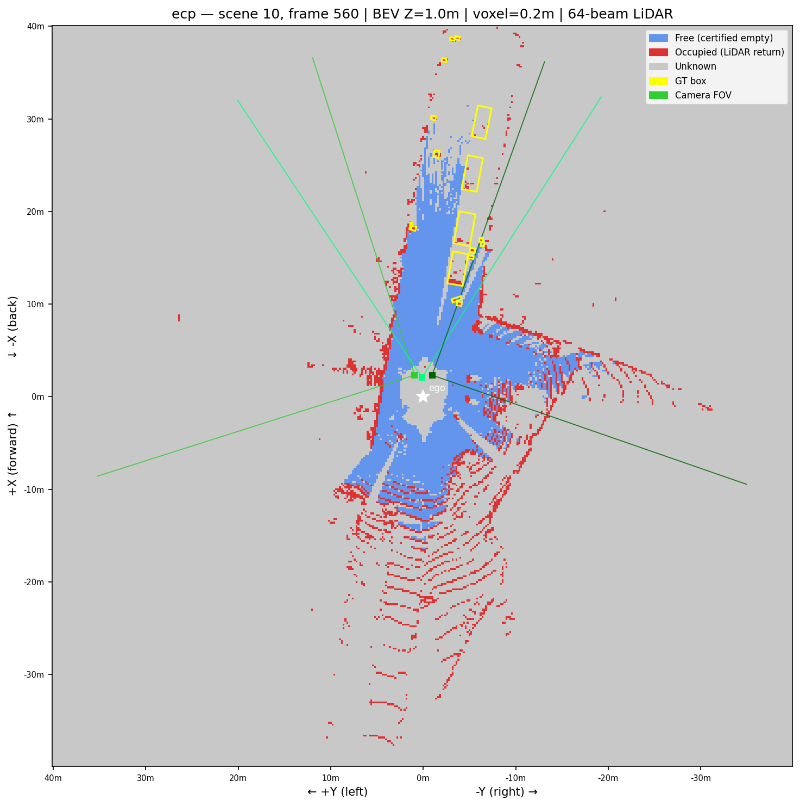
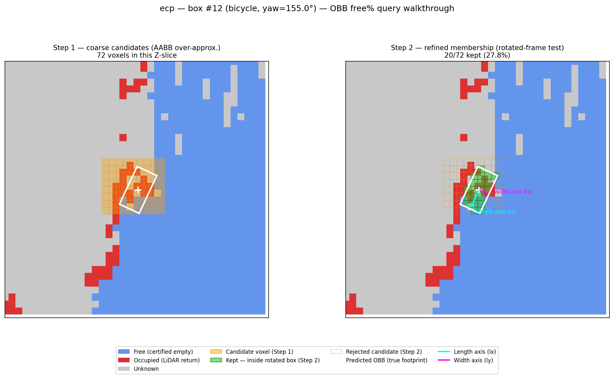
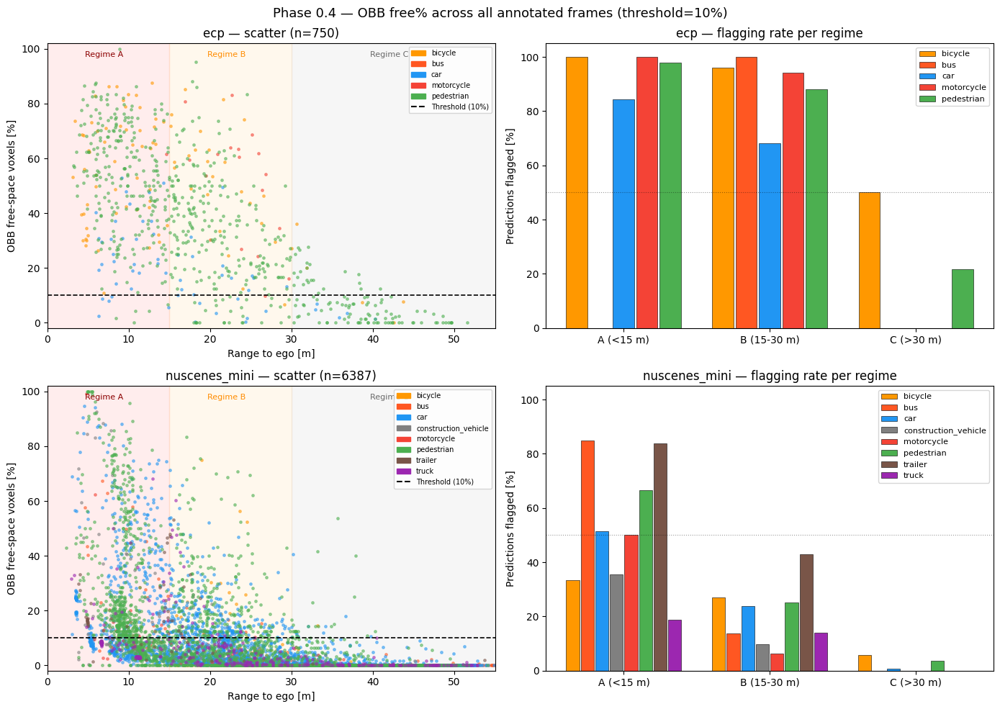
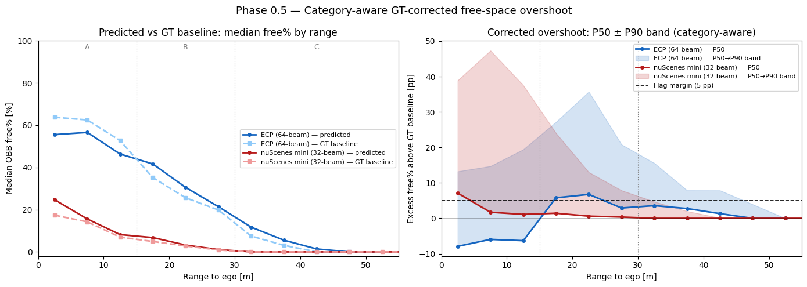
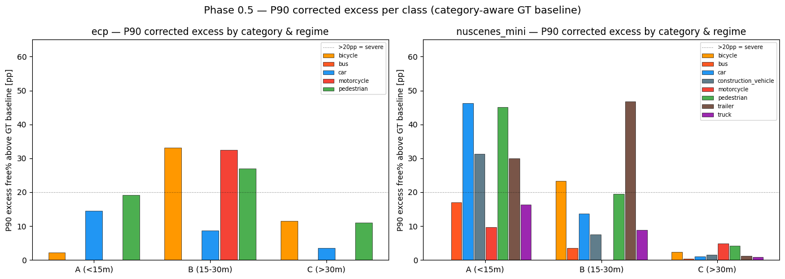

# Phase 0 — Free-Space Overshoot Detection: Results & Conclusions

**Date completed:** 2026-08-27  
**Datasets:** ECP→nuScenes (v1.0-trainval, scenes 10/11/15, 33 annotated frames) · nuScenes mini (v1.0-mini, 323 frames)  
**Predictions:** O3+B1 pipeline output, run on all cameras (best mAP config: ECP 8-class mAP 0.1866)  
**Notebook:** `Contribution/notebooks/phase0_freespace.ipynb`  
**Batch script:** `Contribution/scripts/experiment_a_batch.py`  
**Raw CSVs:** `Contribution/results/experiment_a_ecp.csv` (750 rows) · `experiment_a_nuscenes_mini.csv` (6387 rows)

---

## 1. Goal

Determine whether the predicted 3D bounding boxes produced by the generative SAM3D Objects pipeline extend into space that the LiDAR sensor has *already certified as empty* — i.e. whether the generative prior overshoots the true object extent. This is the core motivating claim of the thesis contribution: LiDAR free-space evidence is a strong, currently unused constraint on box size.

---

## 2. Methodology

### 2.1 Free-space map

A log-odds occupancy grid is built for each keyframe from the aggregated LiDAR sweep:

- **Voxel size:** 0.1 m (BEV), 0.2 m (vertical)  
- **Update rule:** `LO_FREE = −0.4` per beam voxel traversed, `LO_OCC = +0.85` at hit voxel  
- **Clamping:** [−5, +10]  
- **Classification:** `< −0.5` → FREE · `> +0.5` → OCCUPIED · otherwise UNKNOWN  
- **Ray caster:** Amanatides & Woo, Numba `@njit` JIT-compiled, ~2–3 M rays/s

**Example — occupancy/free-space map for one keyframe:**

*(placeholder — produced by §7 "BEV visualisation" in `phase0_freespace.ipynb`, which now saves this
file automatically when run. Re-run with `DATASET = 'nuscenes_mini'` for the other dataset's version.)*

### 2.2 OBB free% query

For each predicted box (centre, lwh, yaw in ego frame):

1. **Identify candidate voxels.** The voxel grid is indexed along world X/Y/Z axes. To find which voxels could be inside the rotated box, compute the min/max world extents of the box's 8 corners and collect all voxels that fall within that range. This is a coarse over-approximation — the corners of that range extend beyond the actual rotated box — but it is cheap and guarantees no interior voxel is missed.
2. **Test each candidate for true membership.** For each candidate voxel, compute its position relative to the box centre (`dx, dy, dz`), then express those offsets along the box's own length and width axes using the yaw rotation:  
   `lx = cos(yaw)·dx + sin(yaw)·dy`  (distance along box length direction)  
   `ly = −sin(yaw)·dx + cos(yaw)·dy`  (distance along box width direction)  
   The voxel is inside the box if and only if:  
   `|lx| ≤ length/2  AND  |ly| ≤ width/2  AND  |lz| ≤ height/2`  
   This is a pure coordinate re-expression — no voxel moves, the physical inside/outside relationship is unchanged.
3. **Count certified-free voxels** among those that passed the membership test.
4. **OBB free% = n_free / n_total**

**Example — OBB query walkthrough (coarse candidates → refined rotated-frame membership):**

*(placeholder — produced by §12.1 "OBB free% query walkthrough" in `phase0_freespace.ipynb`, which
saves this file automatically when run.)*

### 2.3 Overshoot flag

A predicted box is **flagged** as overshooting if its OBB free% > 10%.  
The 10% cut tolerates voxelization boundary effects (box faces touch a few free voxels by construction).

### 2.4 Range regimes

| Regime | Range | Rationale |
|--------|-------|-----------|
| A | < 15 m | Dense LiDAR return; strong free-space signal |
| B | 15–30 m | Moderate beam density; partial constraint |
| C | > 30 m | Sparse or absent returns; near-zero constraint |

---

## 3. Aggregate Results

### 3.1 Flagging rate and median OBB free% by regime

| Regime | ECP flagged | ECP median free% | nuScenes flagged | nuScenes median free% |
|--------|-------------|------------------|------------------|-----------------------|
| A (<15 m) | **97%** | **53.0%** | 57% | 12.5% |
| B (15–30 m) | 88% | 32.5% | 23% | 3.2% |
| C (>30 m) | 22% | 4.2% | 2% | 0.0% |

**ECP:** 33 annotated frames, 750 predicted boxes total across all classes.  
**nuScenes mini:** 323 frames, 6387 predicted boxes total.

### 3.2 Interpretation of key numbers

**Median free% (continuous):** The 50th-percentile OBB free% across all boxes in a regime. It measures *how much* the generative prior overshoots on average, independent of the binary flag. A median of 53% (ECP Regime A) means the typical close-range predicted box has more than half its OBB volume in sensor-certified empty space — the box is roughly 2× the object's true extent. A median of 0% (nuScenes Regime C) means the typical far-range box sits entirely in unobserved voxels; the sensor provides no constraint.

**The 10% flag threshold:** Chosen to absorb boundary/voxelization artefacts. Note that this threshold is *sensor-dependent*: a 64-beam scanner (ECP) traverses more voxels per solid angle than a 32-beam scanner (nuScenes), so a correctly-fitted box on ECP already accumulates more certified-free boundary voxels structurally — the 10% bar is easier to clear on ECP for geometric reasons alone. See §5 for the correct fix.

### 3.3 64-beam vs 32-beam sensor gap

The ~4× gap in median free% between ECP (64-beam) and nuScenes (32-beam) at Regime A (53% vs 12.5%) is partly a genuine overshoot signal and partly a sensor-density artefact. 64-beam scans produce denser voxel coverage: more rays traverse the box volume, certifying more voxels free even if the box is only slightly oversized. This does not invalidate the overshoot finding — a 57% flagging rate on 32-beam nuScenes in Regime A still demonstrates real overshoot — but it means absolute free% is not directly comparable across sensors without normalisation.

### 3.4 Class-level observations

From the scatter and bar plots (Phase 0.4):

- **Car / Automobile:** High Regime A flagging on both datasets. Car predictions are systematically over-extended in length or width at close range.
- **Pedestrian / Bicycle:** Also high flagging rates at close range. Generative prior inflates dimensions more severely for thin objects.
- **Truck / Bus (ECP):** Moderate. Larger true extents absorb more LiDAR, leaving fewer purely-free voxels inside the box, but flagging still > 80% in Regime A.
- **Regime C:** All classes near 0% free% and near-0% flagging — the sensor provides no constraint, consistent with expectation.

---

## 4. Visualisations

### 4.1 Aggregate scatter + flagging rate (Phase 0.4, all 356 frames)

*Top row: ECP (750 predictions, 64-beam). Bottom row: nuScenes mini (6387 predictions, 32-beam). Left: OBB free% vs range, coloured by class; dashed line = 10% flag threshold. Right: flagging rate per class per regime.*

### 4.2 Phase 0.5 — GT-corrected overshoot: median + P50→P90 band

*Left: median OBB free% by range — predicted (solid) vs GT baseline (dashed), per sensor. Right: corrected excess (predicted − GT median) with P50 line and P50→P90 shaded band; dashed = 5 pp flag margin.*

### 4.3 Phase 0.5 — P90 corrected excess per category and regime

*P90 corrected excess free% per class per regime, for ECP (left) and nuScenes mini (right). Dotted line at 20 pp = severe inflation threshold.*

### 4.3 Other figures generated in `phase0_freespace.ipynb`

| Figure | Description | Notebook cell |
|--------|-------------|---------------|
| BEV free-space map | Log-odds occupancy slice at ego-frame ground level. GT boxes (green), predictions coloured by OBB free% (YlOrRd, saturates at 40%) | Cell 28 |
| Phase 0.4 scatter (single frame) | Range vs OBB free%, coloured by class | Cell 29 |
| Phase 0.4 bar chart (single frame) | Flagging rate per class | Cell 30 |
| Phase 0.5 — predicted vs GT baseline | Median free% by range + P50→P90 excess band | Cell 35 |
| Phase 0.5 — P90 by category | P90 corrected excess per class per regime, both datasets | Cell 35 |

---

## 5. Phase 0.5 — GT Baseline Results (Category-Aware)

The same OBB query is run on annotated GT boxes (LiDAR-space annotations) for every frame, giving the **sensor-geometry reference free%**: how much certified-free space a *correctly-fitted* box accumulates at a given range and category purely from beam density and voxel resolution. The GT baseline is computed per `(dataset, category, 5 m range bin)` to avoid mixing object types with different beam-penetration profiles (e.g. bicycle vs car).

### 5.1 Sensor-geometry reference free% by category at close range (0–15 m)

| Category | ECP GT free% 0–5 m | ECP GT free% 5–10 m | nuScenes GT free% 5–10 m |
|----------|-------------------|---------------------|--------------------------|
| bicycle | 69% | **83%** | — |
| car | 42% | 34% | 7% |
| pedestrian | 63% | 62% | 19% |
| truck | — | — | 6% |

Bicycles accumulate the highest reference free% (thin object, beams pass straight through the volume). Cars accumulate the lowest on nuScenes (solid body, few beam penetrations). The wide spread in the aggregate (non-category-split) baseline seen earlier was category mixing — not annotation imprecision.

**ECP GT is annotated in LiDAR space** (not projected from images), so these reference values — the "floor": the free% that even a correctly-fitted box shows, purely from sensor geometry — reflect genuine physics, not annotation error.

### 5.2 Corrected overshoot metric

`excess_free% = predicted_free% − GT_median_free%(dataset, category, range_bin)`

Boxes with `excess_free% > 5 pp` are considered genuinely overshooting above the sensor-geometry reference level.

### 5.3 Category-aware results — Regime A

| Dataset | Category | n | P50 excess | P90 excess | >20 pp |
|---------|----------|---|-----------|-----------|--------|
| ECP | bicycle | 57 | −17.4 pp | +2.1 pp | 0% |
| ECP | car | 32 | −6.5 pp | +14.6 pp | 3% |
| ECP | pedestrian | 253 | −4.2 pp | +19.1 pp | 9% |
| nuScenes | **car** | 594 | +2.9 pp | **+46.2 pp** | **27%** |
| nuScenes | **pedestrian** | 816 | +0.4 pp | **+45.2 pp** | **22%** |
| nuScenes | trailer | 37 | +15.6 pp | +30.0 pp | 19% |
| nuScenes | construction_vehicle | 79 | +3.8 pp | +31.4 pp | 14% |

### 5.4 Category-aware results — Regime B

| Dataset | Category | n | P50 excess | P90 excess | >20 pp |
|---------|----------|---|-----------|-----------|--------|
| ECP | **bicycle** | 25 | +14.0 pp | +33.1 pp | 24% |
| ECP | **motorcycle** | 17 | +16.3 pp | +32.4 pp | 29% |
| ECP | pedestrian | 225 | +4.6 pp | +27.0 pp | 18% |
| nuScenes | **trailer** | 21 | +6.1 pp | +46.8 pp | 29% |
| nuScenes | pedestrian | 993 | −0.2 pp | +19.4 pp | 9% |
| nuScenes | car | 1234 | +0.9 pp | +13.6 pp | 4% |

### 5.5 Regime-level summary (category-aware)

| | ECP A | ECP B | ECP C | nuScenes A | nuScenes B | nuScenes C |
|---|---|---|---|---|---|---|
| P50 excess | −6.5 pp | +4.8 pp | +1.5 pp | +1.7 pp | +0.6 pp | 0.0 pp |
| P90 excess | +16.9 pp | **+29.7 pp** | +11.0 pp | **+42.4 pp** | +15.1 pp | +1.7 pp |
| Fraction >20 pp | 7% | **18%** | 0% | **22%** | 7% | 0% |

---

## 6. Key Conclusions

### C1. GT correction is essential — absolute free% is misleading

The raw free% conflates prediction quality with sensor density. A 64-beam ECP scanner certifies so many voxels free at close range that even correct GT boxes score >60%, making the raw 97% ECP Regime A flagging rate nearly meaningless. Category-aware GT normalisation is required for honest comparison across sensors, range regimes, and object types.

### C2. The typical prediction is not inflated — the tail is

After GT correction, **median excess is near zero or negative in Regime A for both datasets**. The hyperinflation observed visually (objects filling the camera frame → inflated SAM3D mesh) is real but concentrated in the tail: **nuScenes car P90=+46 pp, pedestrian P90=+45 pp** in Regime A with 22–27% of predictions exceeding 20 pp excess. The median hides this completely.

### C3. nuScenes Regime A has the strongest tail signal

Because the 32-beam nuScenes sensor produces a low floor (7% for cars at 5–10 m — see §5.1), inflated close-range predictions stand out clearly above it, instead of partly blending into a high baseline the way they would on the denser 64-beam ECP sensor. This is where the image-proximity inflation effect shows up most strongly: when an object fills the camera frame, SAM3D generates an oversized mesh, and because the nuScenes floor is so low, that oversizing appears as a large positive excess rather than being absorbed into the baseline.

### C4. ECP Regime B has the most consistent median overshoot

ECP Regime B shows genuine inflation even at the median: **bicycle +14.0 pp, motorcycle +16.3 pp, pedestrian +4.6 pp**. This is the range band where the 64-beam ECP sensor-geometry reference free% has dropped enough to reveal systematic inflation above it, and where enough LiDAR beams remain to constrain a correction.

### C5. Regime C is clean — free-space provides no constraint there

Both datasets show near-zero excess and zero >20 pp fraction in Regime C. Free-space evidence cannot help at long range on either sensor. Ground-plane contact and anchored metric propagation (Phase 3) must carry that regime.

### C6. SAM3D Objects does not use free-space for sizing

The O3 mode (used here) anchors the depth *position* of the pointmap via LiDAR. Size and shape are determined entirely by the generative prior (TRELLIS + nearest-neighbour mesh lookup). Phase 0 confirms this: the pivot depth is correct but the box can expand freely in all directions, producing the tail inflation.

---

## 7. Implications for the Roadmap

| Phase | Connection to Phase 0/0.5 finding |
|-------|-----------------------------------|
| **Phase 1** | Observability score gates correctability; Regime A (nuScenes car/ped) and Regime B (ECP bicycle/motorcycle) are the primary correctable populations |
| **Phase 2** | 9-DoF post-hoc alignment targets both Regime A (tail, nuScenes) and Regime B (median, ECP); free-surface is the hard wall the box must not cross |
| **Phase 3** | Ground-contact + affine propagation for Regime B/C tail cases where free-space alone is ambiguous (trailer P90=+47 pp in nuScenes B) |
| **Phase 4** | TRELLIS SS guidance: image-proximity inflation (nuScenes A) is a systematic bias that could be injected as a range-dependent scale prior |

---

## 8. Limitations & Open Questions

1. **P90 instability for small categories:** Some category×regime cells have n<10 (e.g. ECP motorcycle Regime A n=1, nuScenes bicycle Regime A n=3). P90 is unreliable there; results marked with small n should be interpreted cautiously.

2. **Single keyframe LiDAR only:** Phase 0 uses the keyframe sweep only. Temporal aggregation (agg=2, 5 frames) would certify more voxels free and likely strengthen the tail signal — testing this is the optional Phase 0.4-agg variant.

3. **Fixed voxel resolution:** 0.2 m isotropic. Halving to 0.1 m would give 8× more voxels (the cost cubes in 3D), providing finer discrimination especially for thin objects where the margin between inside and outside the box is only centimetres. Recommended tunable parameter for Phase 1/2 experiments.

4. **No ego-motion compensation for aggregated sweeps:** Accumulated rays use ego-to-global transforms only; no intra-sweep motion compensation. At highway speeds this introduces ~0.1 m smear, acceptable at the current voxel size.

[def]: phase0_gt_p90_by_category.png