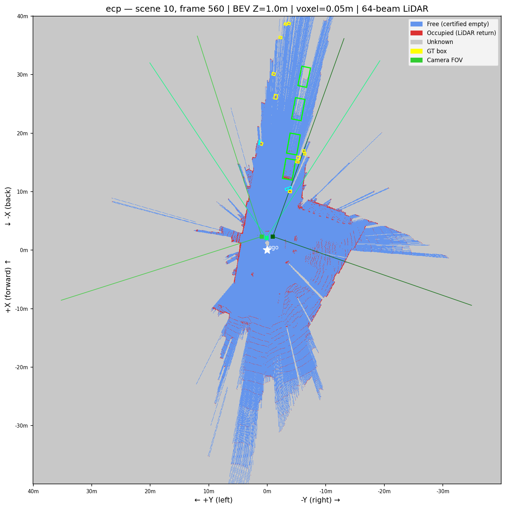
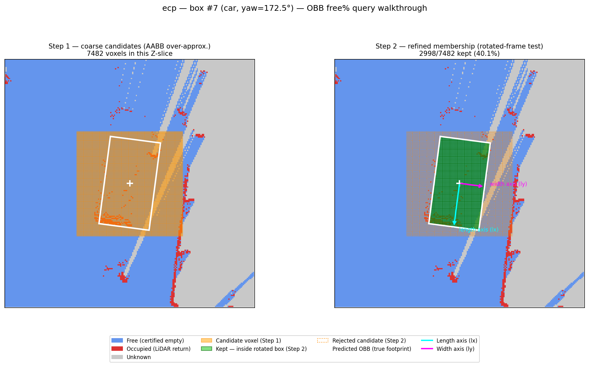
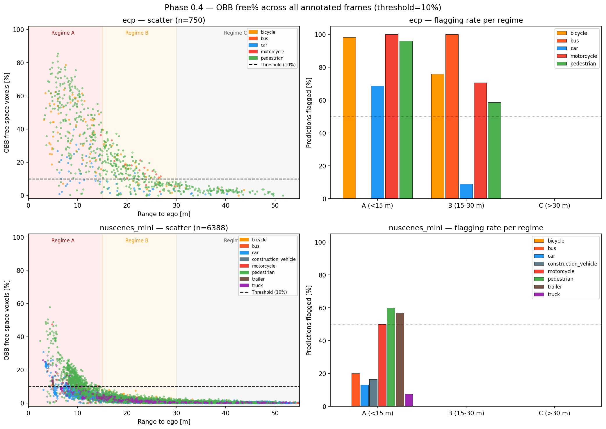
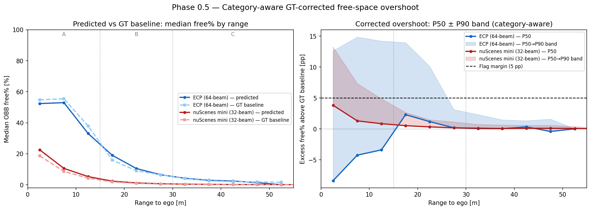
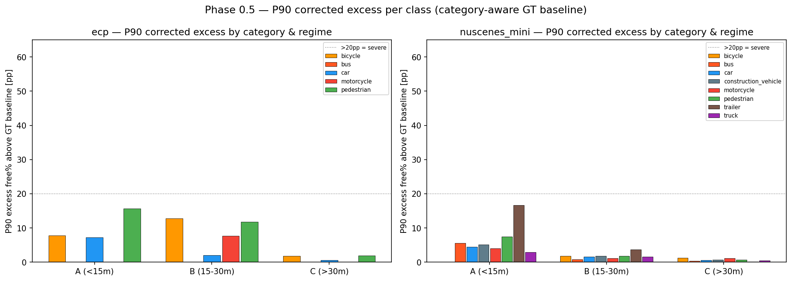

# Phase 0 — Free-Space Overshoot Detection: Results & Conclusions

> **2026-09-29: the free-space claim in this document is superseded at the mesh level.** This measured OBBs from the
> old O3+B1 pipeline. `contribution_ideas/phase0_mesh_freespace/PLAN.md` is the full-dataset follow-up on the
> current clean pipeline, at the mesh level, with a GT-floor shape-isolation control and an "implied by in-mask
> depth" test this document doesn't have — not yet run. The resolution-sensitivity study (§3) and the
> distributional-vs-matched methodology comparison (§6) below are untouched by that follow-up and still stand.

- **Date completed:** 2026-08-27 · **Updated:** 2026-08-31 (three data-integrity bugs found and fixed — see §3.4 — full pipeline rerun at all three voxel sizes, both datasets; this is a substantial revision of §3's conclusions, not just a numbers refresh)
- **Datasets:** ECP→nuScenes (v1.0-trainval, scenes 10/11/15, 33 annotated frames) · nuScenes mini (v1.0-mini, 323 frames)
- **Predictions:** O3+B1 pipeline output, run on all cameras (best mAP config: ECP 8-class mAP 0.1866)
- **Notebook:** `Contribution/phase0/notebooks/phase0_freespace.ipynb`
- **Scripts:** `Contribution/phase0/scripts/experiment_a_batch.py` (distributional excess_free% metric),
  `Contribution/phase0/scripts/experiment_a_matched_pairs.py` (object-matched absolute free-voxel comparison)
- **Final voxel size:** 0.05 m isotropic (see §3 — chosen for compute/memory cost, not because the signal fully converges there — see §3.1's revised interpretation)
- **Raw CSVs:** `experiment_a_ecp.csv` (750 rows), `experiment_a_nuscenes_mini.csv` (6388 rows),
  `experiment_a_matched_pairs_ecp.csv` (582 rows), `experiment_a_matched_pairs_nuscenes_mini.csv` (3516 rows).
  Resolution-study variants tagged `_vox0.2` / `_vox0.1` (e.g. `experiment_a_ecp_vox0.2.csv`).

---

## 1. Goal

Determine whether the predicted 3D bounding boxes produced by the generative SAM3D Objects pipeline extend into space that the LiDAR sensor has *already certified as empty* — i.e. whether the generative prior overshoots the true object extent. This is the core motivating claim of the thesis contribution: LiDAR free-space evidence is a strong, currently unused constraint on box size.

Two independent metrics answer this question in this document, because they turned out to disagree in an informative way (§6):

- **Distributional `excess_free%`** (§4) — every predicted box's free% is normalised by its own volume and compared against a *category+range-bin GT median* (no per-object correspondence needed). This was the original Phase 0 design.
- **Object-matched absolute comparison** (§5) — individual GT boxes are matched to individual predictions of the same real object, and their *absolute* free-voxel counts are compared directly. Added after the distributional metric was found to under-count the most extreme oversizing failures (§6.1).

---

## 2. Methodology

### 2.1 Free-space map

A log-odds occupancy grid is built for each keyframe from the LiDAR sweep:

- **Voxel size:** 0.05 m, isotropic (all three axes) — see §3 for why
- **Update rule:** `LO_FREE = −0.4` per voxel traversed, `LO_OCC = +0.85` at the return voxel (Amanatides & Woo exact traversal, not a fixed-step approximation)
- **Clamping:** [−5, +10]
- **Classification:** `< −0.2` → FREE · `> +0.5` → OCCUPIED · otherwise UNKNOWN — the FREE threshold was `−0.5` until 2026-08-31; see §3.4 for why that was wrong and what changed
- **Ray caster:** Numba `@njit` JIT-compiled

**Example — occupancy/free-space map for one keyframe:**

*Produced by §7 "BEV visualisation" in `phase0_freespace.ipynb`.*

### 2.2 OBB free% query

For each box (centre, lwh, yaw in ego frame):

1. **Identify candidate voxels.** Take the box's half-diagonal — `diag = sqrt((length/2)² + (width/2)²)` — and collect every voxel inside the axis-aligned cube `[centre − diag, centre + diag]`. Because every corner of a rectangle is equidistant (`diag`) from its centre, this cube contains the box at *any* yaw without needing to know it. It's looser than the box's true axis-aligned bounding rectangle at its actual yaw, but cheap, yaw-independent, and never misses an interior voxel.
2. **Test each candidate for true membership**, split into an inexpensive 2-D rotated-frame test (X/Y only — the part whose cost would otherwise multiply by the Z extent) plus a 1-D Z-range test:
   `lx = cos(yaw)·dx + sin(yaw)·dy`, `ly = −sin(yaw)·dx + cos(yaw)·dy`; inside iff `|lx| ≤ length/2 ∧ |ly| ≤ width/2 ∧ |dz| ≤ height/2`.
3. **Count certified-free voxels** among those that passed.
4. **OBB free% = n_free / n_total.**

This queries the real 3-D grid directly with each box's true height — it was never affected by the Z-band display bug described in §3.4 item 3, which only ever touched the 2-D BEV/cross-section *pictures*, not this query.

**Example — OBB query walkthrough (coarse candidates → refined rotated-frame membership):**

### 2.3 Overshoot flag

A predicted box is **flagged** as overshooting if its raw OBB free% > 10%. This raw threshold is retained for §4.1's uncorrected numbers only; §4 and §5's actual findings use the GT-corrected / matched metrics below, not this flag.

### 2.4 Range regimes

| Regime | Range | Rationale |
|--------|-------|-----------|
| A | < 15 m | Dense LiDAR return; strong free-space signal |
| B | 15–30 m | Moderate beam density; partial constraint |
| C | > 30 m | Sparse or absent returns; near-zero constraint |

> **These cutoffs are fixed round numbers, not derived per-sensor, and not the same thing as the
> A/B/C/D evidence taxonomy `contribution_plan.md` actually defines** (that taxonomy is explicitly
> "defined by evidence, not by distance" — LiDAR density × image visibility, §12–13 of that document).
> Distance is used here only as a cheap, computable proxy for it. That proxy is sensor-dependent: see
> §10 for why the same range window means substantially different things on ECP vs nuScenes.

### 2.5 Object-matched absolute free-voxel comparison (§5's method)

Complements the distributional metric by matching individual GT boxes to individual predictions and comparing **absolute** free-voxel counts, which is not diluted by a wildly oversized box's own inflated denominator (§6.1).

- **Scope:** Regime A/B only. Regime C has too little LiDAR signal (mostly UNKNOWN space) and GT/pred boxes are too unreliably close in range to match with any confidence there.
- **Matching:** global greedy assignment by ascending 2-D spatial distance between box centres (not range-from-ego magnitude — see the box below), per category, per frame. Every (GT, pred) pair of the same category is considered in order of increasing distance; a pair is accepted only if both its GT and its prediction are still unclaimed.
- **Distance cutoff:** 5 m. Beyond this a "match" isn't a plausible same-object correspondence — without a cutoff, once close candidates are used up, leftover objects get forced together regardless of how far apart they actually are (observed: a pedestrian at 6.85 m force-matched to one at 39.26 m before this was added). Pairs beyond the cutoff are left unmatched and counted, not force-paired.
- **No size-plausibility filter.** Unlike the distance cutoff, matches are *not* rejected for having very different GT/prediction sizes — the whole point of this experiment is to capture the hyperinflated-box failure mode, not exclude it.
- **Per matched pair:** `absolute_diff = n_free_pred − n_free_gt`; `relative_excess = absolute_diff / n_free_gt` (only defined when `n_free_gt ≥ 1`).

> **Why distance, not range.** An earlier version matched by `|gt_range − pred_range|` (distance from ego only). Two objects can sit at the same distance from the car in completely different directions — one far left, one far right — which that metric treats as "close." QA visualisation (`phase0_matching_qa_*.png`) caught this directly: connector lines spanning the entire 40 m scene. Switching to actual 2-D spatial distance between box centres fixed it (median match distance dropped to 0.15–0.28 m); see `phase0_matching_qa_*.png` for the corrected, visually verified version.

---

## 3. Resolution Sensitivity — 0.2 m → 0.1 m → 0.05 m

Phase 0 originally ran at 0.2 m. This section was rewritten on 2026-08-31 after fixing the `THRESHOLD_FREE` bug in §3.4 — **the previous version of this table was computed under a broken free-space threshold and its headline conclusion ("mostly voxelization artifact, only ECP Regime A is real") no longer holds.** The corrected numbers below tell a different story.

### 3.1 Distributional `excess_free%`, P90 (the "tail" metric), across resolutions

| Regime | 0.2 m | 0.1 m | 0.05 m | Trend |
|---|---|---|---|---|
| ECP A | +16.2 pp | +13.5 pp | +14.8 pp | roughly flat, ~14–16 pp at every resolution |
| ECP B | +27.4 pp | +22.1 pp | +11.7 pp | shrinks, but stays well clear of zero |
| ECP C | +20.1 pp | +7.8 pp | +1.9 pp | shrinks toward a small residual |
| nuScenes A | +17.5 pp | +12.6 pp | +6.4 pp | shrinks, stays non-trivial |
| nuScenes B | +12.5 pp | +6.0 pp | +1.7 pp | shrinks toward a small residual |
| nuScenes C | +8.4 pp | +2.4 pp | +0.6 pp | shrinks toward a small residual |

**Revised interpretation.** Every cell still shrinks with finer resolution — that part of the original story survives (§3.2 still shows the GT floor itself shrinking, and that explanation is independent of §3.4's threshold bug). What's different now: **no cell converges all the way to zero.** Under the old, broken threshold, B and C cells collapsed to ~0.0 pp at 0.05 m, which read as "no real signal beyond Regime A." Under the corrected threshold, every regime on both datasets retains a non-trivial residual at 0.05 m — smallest in nuScenes C (+0.6 pp) but still clearly present, and substantial in both B regimes (ECP +11.7 pp, nuScenes +1.7 pp) which previously looked fully explained by voxelization noise. **The free-space overshoot signal is more pervasive across regimes than the pre-fix analysis concluded — it was never purely an ECP-Regime-A phenomenon, the old threshold bug was just hiding the rest of it.**

ECP Regime A remains the largest, most stable signal (~14–16 pp across all three resolutions) and is still the best-evidenced single cell for thesis claims. But it is no longer the *only* one worth reporting.

### 3.2 Why: the GT floor itself shrinks with resolution (unchanged conclusion, refreshed numbers)

If finer voxels were only reducing genuine overshoot, the *floor* (median free% of a correctly-fitted GT box) should stay roughly constant. It doesn't — it drops everywhere, at every resolution tested, independent of the §3.4 threshold fix:

| Category | 0.2 m floor | 0.1 m floor | 0.05 m floor |
|---|---|---|---|
| ECP bicycle, 0–5 m | 70.8% | 68.1% | 55.5% |
| ECP bicycle, 5–10 m | 86.8% | 82.7% | 68.3% |
| ECP car, 0–5 m | 45.2% | 36.7% | 29.3% |
| ECP car, 5–10 m | 36.4% | 31.5% | 24.6% |
| ECP pedestrian, 0–5 m | 65.4% | 66.8% | 61.0% |
| ECP pedestrian, 5–10 m | 64.6% | 66.3% | 55.9% |
| nuScenes car, 5–10 m | 20.4% | 10.9% | 4.9% |
| nuScenes pedestrian, 5–10 m | 65.3% | 32.9% | 14.2% |
| nuScenes truck, 5–10 m | 26.3% | 15.7% | 7.0% |

This is still consistent with **coarse voxels over-counting partially-occupied regions as free** — a large 0.2 m voxel that's mostly inside an object but grazed by a few beams near its edge gets marked FREE wholesale; at 0.05 m the same physical region resolves into many small voxels, most of which correctly read OCCUPIED or UNKNOWN. This mechanism is real and separate from the §3.4 threshold bug (it operates on the *classification of genuinely-touched voxels*, not on whether a touched voxel gets classified as free at all) — which is exactly why the floor still shrinks with resolution even after the fix. **What changed is that the *predicted* free% now shrinks by a smaller amount than the floor does in several cells, instead of shrinking in lockstep** — that gap is the residual excess in §3.1's revised table.

A secondary, real effect was checked and ruled out as an alternative explanation: log-odds accumulates per voxel-*step*, not per meter, so the physical distance needed to certify FREE is technically resolution-dependent. Tested directly — it saturates within 1–2 voxel-widths at any resolution tested here, and would bias the numbers in the *opposite* direction from what was observed (finer resolution → easier to certify free → *higher* floor, not lower). So it isn't the driver.

### 3.3 Practical/implementation notes from this study

- **Ray-casting itself was correct at every resolution** (Amanatides & Woo exact traversal, unaffected by voxel size choice) and was independently verified against ground truth (a `matplotlib.path.Path` polygon-containment test) — the OBB query algorithm reproduces it exactly, 0 mismatches across randomized trials up to 12 m objects.
- **A real memory bug was found and fixed at 0.05 m.** The original `query_box_freespace_obb` built several full 3-D float64 temporary arrays over the whole candidate cuboid; for a large object (bus/trailer) at fine voxel size that cuboid can be hundreds of voxels per axis, costing 300+ MB per box query — this caused two full-system OOM crashes when running the batch pipeline on both datasets in one process. Fixed by splitting the geometry test into a 2-D (X/Y) pass plus a 1-D Z-range test, cutting peak per-query memory by ~40× (measured: 469 MB → 11.6 MB on a synthetic worst-case object) and eliminating the crash.
- **`NuScenes(v1.0-trainval)` init for the ECP-converted dataset costs ~7.4 GB** by itself (its `sample_data.json` is 1.6 GB vs nuScenes-mini's 16 MB, indexing far more raw sensor readings than the 33 frames actually used) — unrelated to voxel size, but combined with the above it's why processing both datasets in a single process is unsafe. Both datasets must be run as **separate processes**, each under a virtual-memory `ulimit` so any runaway allocation fails cleanly instead of swap-thrashing the system.
- **0.05 m remains the resolution used for the final numbers (§4, §5), chosen for compute/memory cost, not because the signal has converged there** — §3.1's revised reading shows every cell was still shrinking at 0.05 m. Going to 0.025 m would cost another 8× in grid memory; not attempted.

### 3.4 Data-integrity bugs found and fixed (2026-08-31)

Three separate bugs were found this session, in the order discovered, while chasing why a nuScenes BEV render looked visually wrong. Two changed real numbers in this document; one was display-only.

**1. nuScenes LiDAR stride bug (real, nuScenes-only).** The parser used `stride = 5 if dataset == 'ecp' else 4` to reshape the raw float32 `.bin` buffer. nuScenes `LIDAR_TOP` sweeps are actually 5 columns `(x, y, z, intensity, ring_index)`, same as ECP — confirmed against the nuScenes devkit's own `LidarPointCloud.from_file()` and against plausible ring-index ranges (0–31 for the 32-beam sensor). Reshaping with stride 4 silently scrambled every point. Fixed; nuScenes rerun.

**2. `THRESHOLD_FREE` miscalibrated for single-sweep mode (real, both datasets — the dominant bug).** A single ray traversal only contributes one `LO_FREE = −0.4` log-odds step, but the old threshold (`−0.5`) required the equivalent of *two* independent ray crossings through the same voxel to certify FREE. Since this pipeline deliberately uses one LiDAR sweep with no temporal aggregation (§25.2 of `contribution_plan.md`), most voxels are only ever crossed once — so the vast majority of genuinely swept-through free space was silently reclassified UNKNOWN. Measured directly on a real nuScenes frame: **72.8% of every voxel a beam actually passed through sat at exactly one `LO_FREE` step and was being thrown away.** With the corrected threshold (`−0.2`, chosen so a single pass alone certifies FREE), **99.6%** of touched voxels are correctly classified. This fed `query_box_freespace_obb` directly (§2.2), so it is baked into every `frac_free`-derived number that existed before 2026-08-31 — both datasets, every resolution. It is also resolution-dependent in its own right: finer voxels make double-hits from diverging rays rarer, so the old bug's damage *grew* at finer resolution, which is exactly why §3.1's pre-fix table showed B/C regimes collapsing to ~0 pp at 0.05 m — that collapse was substantially the bug, not a real convergence.

**3. BEV/cross-section Z-band collapse used a raw `.max()` on signed log-odds (display-only — does not affect any number in this document).** Untouched voxels are exactly `0`, free voxels are negative, and `0 > any negative value` — so a single untouched voxel anywhere in a visualized height band masked real free-space evidence from every other layer in that column. This was the proximate reason the BEV pictures looked wrong (free space stopping short of occupied returns instead of reaching them); fixed with an any()-based, occupied-takes-priority reduction in the notebook's visualization cells. `query_box_freespace_obb` never used this reduction — it always indexed the real 3-D grid directly — so this bug never touched a reported statistic.

**Fixed in** `experiment_a_batch.py`, `experiment_a_matched_pairs.py`, and the notebook, then the **entire pipeline was rerun**: both datasets, all three voxel sizes, plus the matched-pairs comparison at the final 0.05 m resolution. Matched-pair *counts* are identical to the pre-fix run (582 ECP, 3516 nuScenes mini) — matching depends only on box positions from the annotation/prediction JSON, never on occupancy, so this confirms the matching step itself was never affected; only the free-voxel counts per pair changed.

---

## 4. Distributional `excess_free%` — Final Results (0.05 m)

`excess_free% = predicted_free% − GT_median_free%(dataset, category, range_bin)`. Boxes with `excess_free% > 5 pp` are considered genuinely overshooting above the sensor-geometry reference level. These are the resolution- and threshold-corrected final numbers as of 2026-08-31 — they supersede every earlier number in this document.

### 4.1 Raw (uncorrected) reference numbers, for context only

| Regime | ECP flagged | ECP median free% | nuScenes flagged | nuScenes median free% |
|--------|-------------|------------------|------------------|-----------------------|
| A (<15 m) | 93.9% | 41.3% | 36.9% | 7.9% |
| B (15–30 m) | 57.2% | 11.7% | 0.0% | 1.3% |
| C (>30 m) | 0.0% | 2.8% | 0.0% | 0.2% |

(At 0.2 m these were 98.3%/55.6% and 97.5%/35.6% for ECP/nuScenes Regime A respectively — the raw, uncorrected flag rate is *itself* highly resolution-dependent, on top of needing the GT correction below. Use §4.2, not this table, for any actual claim.)

### 4.2 Category-aware, GT-corrected results — Regime A

| Dataset | Category | n | P50 excess | P90 excess | >20 pp |
|---------|----------|---|-----------|-----------|--------|
| ECP | bicycle | 57 | −11.3 pp | +7.8 pp | 1.8% |
| ECP | car | 32 | −3.9 pp | +7.3 pp | 0.0% |
| ECP | pedestrian | 253 | −2.6 pp | +15.6 pp | 5.5% |
| nuScenes | bicycle | 3 | −1.5 pp | −1.2 pp | 0.0% |
| nuScenes | bus | 20 | +1.2 pp | +5.6 pp | 0.0% |
| nuScenes | car | 594 | +1.4 pp | +4.5 pp | 0.0% |
| nuScenes | construction_vehicle | 79 | +1.8 pp | +5.1 pp | 0.0% |
| nuScenes | motorcycle | 24 | +1.3 pp | +4.1 pp | 4.2% |
| nuScenes | pedestrian | 816 | +0.8 pp | +7.5 pp | 2.0% |
| nuScenes | trailer | 37 | +11.4 pp | +16.7 pp | 5.4% |
| nuScenes | truck | 122 | +0.8 pp | +3.0 pp | 0.0% |

(ECP motorcycle n=1, omitted — not statistically meaningful.)

### 4.3 Regime-level summary (category-aware, 0.05 m final)

| | ECP A | ECP B | ECP C | nuScenes A | nuScenes B | nuScenes C |
|---|---|---|---|---|---|---|
| n | 343 | 290 | 117 | 1695 | 2600 | 2093 |
| P50 excess | −4.1 pp | +1.2 pp | +0.1 pp | +1.2 pp | +0.3 pp | +0.1 pp |
| P90 excess | **+14.8 pp** | +11.7 pp | +1.9 pp | +6.4 pp | +1.7 pp | +0.6 pp |
| Fraction >20 pp | 4.7% | 1.4% | 0.0% | 1.1% | 0.0% | 0.0% |

At the resolution- and threshold-corrected distributional metric, **ECP Regime A and ECP Regime B both carry a clearly non-trivial tail** (P90 = 14.8 pp and 11.7 pp respectively) — a materially broader finding than the pre-fix version of this document, which found only Regime A meaningful. nuScenes Regime A also carries a real, if smaller, tail (+6.4 pp). C regimes on both datasets are small but no longer exactly zero. This metric's own-volume normalisation still has a known blind spot (§6.1) — §5 tells a materially different, larger-magnitude story for several categories.

---

## 5. Object-Matched Absolute Free-Voxel Comparison — Results (0.05 m)

Methodology: §2.5. 582 matched pairs (ECP), 3516 matched pairs (nuScenes mini); 188/3308 predictions and 306/3754 GT boxes respectively left unmatched (count mismatch or beyond the 5 m cutoff — a separate false-positive/false-negative question, not this experiment's job). Median match spatial distance 0.15 m (ECP) / 0.28 m (nuScenes) — matching verified visually correct on 20 full-scene QA renders plus a targeted spot-check (`phase0_matching_qa_*.png`), no remaining scene-spanning mismatches. Match counts and match distances are identical to the pre-§3.4-fix run, confirming the matching step itself was never affected by the threshold bug.

### 5.1 Full results table

| Dataset | Category | Regime | n | absdiff median | absdiff P90 | relexc median | relexc P90 |
|---|---|---|---|---|---|---|---|
| ECP | bicycle | A | 56 | +4135.5 | +20795.5 | **+115.9%** | +824.2% |
| ECP | bicycle | B | 22 | +533.5 | +2177.4 | +68.8% | +347.1% |
| ECP | car | A | 30 | +6306.5 | +174720.6 | **+27.7%** | +897.8% |
| ECP | car | B | 23 | +129.0 | +1907.4 | +4.5% | +37.9% |
| ECP | motorcycle | B | 15 | +1866.0 | +3374.4 | +152.1% | +256.4% |
| ECP | pedestrian | A | 232 | −273.0 | +948.9 | −19.1% | +88.8% |
| ECP | pedestrian | B | 204 | −67.0 | +231.4 | −19.5% | +109.2% |
| nuScenes | bicycle | A | 1 | +17.0 | +17.0 | +2.0% (n=1) | n/a |
| nuScenes | bicycle | B | 51 | −16.0 | +224.0 | −5.7% | +112.3% |
| nuScenes | bus | A | 13 | +53922.0 | +168623.2 | **+137.8%** | +486.5% |
| nuScenes | bus | B | 75 | +3444.0 | +9787.4 | +90.5% | +169.8% |
| nuScenes | car | A | 531 | +1557.0 | +5656.0 | **+31.5%** | +132.7% |
| nuScenes | car | B | 1062 | +355.0 | +1469.9 | +45.6% | +236.2% |
| nuScenes | construction_vehicle | A | 64 | +23502.0 | +40613.8 | **+296.9%** | +435.4% |
| nuScenes | construction_vehicle | B | 28 | +7426.0 | +38458.5 | +225.5% | +632.3% |
| nuScenes | motorcycle | A | 23 | +120.0 | +1469.2 | +7.6% | +59.7% |
| nuScenes | motorcycle | B | 15 | +65.0 | +337.6 | +22.2% | +87.2% |
| nuScenes | pedestrian | A | 695 | −195.0 | +111.6 | −33.8% | +31.7% |
| nuScenes | pedestrian | B | 817 | −57.0 | +11.0 | −53.0% | +14.4% |
| nuScenes | truck | A | 66 | −11943.5 | +7563.0 | −35.6% | +51.9% |
| nuScenes | truck | B | 75 | +452.0 | +2281.8 | +22.7% | +95.8% |

*(nuScenes bicycle-Regime-A has n=1, too small to be meaningful. Both trailer rows had zero valid matches in either regime. Unlike the pre-§3.4-fix run, `relative_excess` is now defined for nearly every matched pair — under the old broken threshold many GT boxes had `n_free_gt = 0`, making the ratio undefined; the fix resolved that almost everywhere too.)*

### 5.2 Headline finding

**Several categories show substantial oversizing at the median, not just the tail** — something the distributional metric's own-volume normalisation was hiding:

| Category (Regime A) | Median rel. excess | P90 rel. excess |
|---|---|---|
| nuScenes construction_vehicle | **+296.9%** | +435.4% |
| nuScenes bus | **+137.8%** | +486.5% |
| ECP bicycle | **+115.9%** | +824.2% |
| nuScenes car | **+31.5%** | +132.7% |
| ECP car | **+27.7%** | +897.8% |

For bus/bicycle/construction_vehicle, the *typical* Regime-A prediction already touches 115–300% more absolute free space than its matched GT box. Car is genuinely inflated on both sensors once measured this way (median +28–32%), a conclusion the distributional metric (§4) missed entirely for nuScenes car. Pedestrian and truck remain negative at the median (typically tight-or-conservative) but still carry large positive P90 tails — the same "median hides it, tail reveals it" pattern as §4, just with materially larger, more direct magnitudes.

---

## 6. Comparing the Two Methodologies

### 6.1 Why they disagree: a concrete case study

A matched illustrative example (car, ECP, Regime A, range 3.9 m) paired a normal GT car (88,473 voxels ≈ 11.1 m³ at 0.05 m, 33.0% free — close to the 29.3% category floor at this range) with a predicted box **4,978,484 voxels ≈ 622 m³ — a 56× volume ratio**, only 6.7% free. Under the distributional metric this pair reports **negative** excess (6.7% predicted free < 29.3% GT floor) — the metric says the prediction looks *better than average*. The predicted box's footprint alone is 15.7× the GT box's BEV area, and the overwhelming majority of its volume reads UNKNOWN rather than FREE (no beam reaches most of a box that size), which dilutes `frac_free = n_free / n_total` even though the box's *absolute* free-voxel footprint is enormous: +306,174 more free voxels than the GT box, a **+1049% relative excess**. **A wildly oversized box can score better than a correct one on the distributional metric, precisely in its most extreme failure cases.**

The object-matched metric doesn't have this blind spot: it compares `n_free_pred` directly against `n_free_gt` for the same real object, so an oversized box's larger absolute footprint shows up as a large positive number regardless of how much of its own volume is UNKNOWN.

### 6.2 Where they agree

Both metrics agree on the qualitative shape of the result:

- Regime A is the strongest signal on both datasets, on every measure.
- Tail (P90) is substantially worse than the median almost everywhere.
- Regime C carries the weakest signal on either metric — free space constrains far-range boxes only weakly, not not-at-all as the pre-fix analysis suggested.

### 6.3 Which to trust, and for what

- **Distributional `excess_free%` (§4)** is the metric to use for **cross-sensor, cross-size comparability** (it's what lets you compare a pedestrian's overshoot to a truck's on the same footing) and for the **resolution-sensitivity study** (§3), since it doesn't depend on having reliable object correspondence. Its weakness: it under-counts the most extreme oversizing cases exactly because of the normalisation that makes it comparable.
- **Object-matched absolute comparison (§5)** is the metric to use for **"how much real free space does this specific class of failure touch"** claims, and it is the one that correctly surfaces the hyperinflated-box failure mode. Its weaknesses: restricted to Regime A/B (§2.5), depends on a matching heuristic (greedy, not globally optimal, with a tunable 5 m cutoff), and roughly a third of predictions/GT go unmatched (a separate false-positive/negative signal, not folded into this table).

**Combined conclusion for the thesis:** the free-space overshoot the original Phase 0 hypothesis predicted is real, demonstrable by two independent measurements, and — now that the §3.4 threshold bug is fixed — **broader than either the original 0.2 m analysis or the first post-stride-fix analysis concluded.** It is strongest at close range (Regime A) and concentrated in specific categories (bicycle, bus, construction_vehicle, car), but it is not confined to ECP Regime A alone: every regime on both datasets now shows a real, non-zero residual after GT correction.

---

## 7. Visualisations

### 7.1 Aggregate scatter + flagging rate (Phase 0.4, all 356 frames, 0.05 m)

*Top row: ECP (750 predictions, 64-beam). Bottom row: nuScenes mini (6388 predictions, 32-beam). Left: raw OBB free% vs range, coloured by class; dashed line = 10% flag threshold. Right: raw flagging rate per class per regime. These are the uncorrected numbers of §4.1 — see §7.2 for the GT-corrected view.*

### 7.2 GT-corrected overshoot: median + P50→P90 band

*Left: median OBB free% by range — predicted (solid) vs GT baseline (dashed), per sensor. Right: corrected excess (predicted − GT median) with P50 line and P50→P90 shaded band; dashed = 5 pp flag margin. Matches §4.3's regime-level summary numbers.*

### 7.3 P90 corrected excess per category and regime

*P90 corrected excess free% per class per regime, ECP (left) and nuScenes mini (right). Dotted line at 20 pp = severe inflation threshold. Matches §4.2's category-level table exactly.*

### 7.4 Other figures (embedded at point of use in §2.1/§2.2, or available in the results folder)

| Figure | Description |
|---|---|
| `phase0_occupancy_map_example_{dataset}.png` | Full-scene BEV free/occupied/unknown map, one keyframe — embedded in §2.1 |
| `phase0_obb_query_walkthrough_{dataset}.png` | Coarse-candidate → refined-membership OBB query, one box, both steps — embedded in §2.2 |
| `phase0_regime_comparison_{dataset}.png` | GT vs predicted OBB, one category across A/B/C, single demo frame |
| `phase0_regime_comparison_all_categories_{dataset}.png` | Same, but one row per category (every category with an available example) |
| `phase0_matching_qa_{dataset}.png` | 10-frame grid: every GT/prediction box in each scene, matched pairs connected by a line (green = plausible, red = hyperinflated >3×), used to visually validate §2.5's matching |
| `phase0_matching_qa_nuscenes_scene3_frame65.png` | Single-frame matching example (dense parking-lot scene, 23 clean matches, 0 hyperinflated) |
| `phase0_side_profile_closest_car_{dataset}.png` | Length×height cross-section through the closest GT car's centreline — free/occupied/unknown voxels alongside the GT box outline, produced by notebook §7.1 |

---

## 8. Key Conclusions

### C1. The free-space constraint is real and broader than either previous analysis found

The 2026-08-27 analysis (0.2 m) overstated the magnitude; the first correction (resolution study + GT baseline, still under a broken `THRESHOLD_FREE`) understated its breadth, concluding only ECP Regime A was real. With both the resolution study and the free-space threshold corrected, **every regime on both datasets carries a non-zero, non-trivial residual excess after GT correction** — strongest in ECP A/B and nuScenes A, weak but present in the C regimes. **Report the 0.05 m, threshold-corrected numbers in §4/§5, not any earlier version, in the thesis.**

### C2. GT correction and resolution correction are both essential — raw free% and coarse-voxel free% are each independently misleading

Raw (uncorrected) 0.05 m flagging differs enormously from the 0.2 m raw numbers (ECP A: 98.3%→93.9%, nuScenes A: 97.5%→36.9%) from resolution alone, on top of the sensor-density confound §4.1 already documents. Both corrections must be applied before any number in this document means what it claims to mean.

### C3. The typical prediction is not inflated — the tail is (distributional view) — but several categories ARE inflated even at the median (matched-object view)

Distributionally, median excess is at or below zero for most categories; the story is largely in the P90 tail. Object-matched, several categories (bicycle, bus, construction_vehicle, car) show **large positive median** absolute overshoot in Regime A — for these classes inflation is typical behaviour, not a tail phenomenon. These are not contradictory findings; §6 explains why the two metrics see different amounts of the same underlying failure.

### C4. The distributional metric has a real, demonstrated blind spot for the most extreme failures

§6.1's case study (56× volume ratio, negative reported excess) shows the own-volume-normalised metric can score a wildly oversized box as *better than average*. Any thesis claim built solely on the distributional metric should note this; the object-matched metric (§5) is the corrective measurement.

### C5. Regime C provides the weakest constraint on either metric, but is no longer "no signal at all"

Both metrics show their smallest values in Regime C at every resolution tested, but — unlike the pre-fix analysis — neither is exactly zero at 0.05 m (ECP C P90 = +1.9 pp, nuScenes C P90 = +0.6 pp). Ground-plane contact and anchored metric propagation (Phase 3, §13 of `contribution_plan.md`) should still carry most of that regime's correction burden; free space contributes only a weak constraint there, not none.

### C6. SAM3D Objects does not use free-space for sizing (unchanged from original finding)

The O3 mode anchors depth *position* via LiDAR; size and shape come entirely from the generative prior. Both metrics, at the corrected resolution and threshold, are consistent with this: the pivot depth is right, the box can still expand freely in all directions.

---

## 9. Implications for the Roadmap

| Phase | Connection to Phase 0/0.5 finding |
|-------|-----------------------------------|
| **Phase 1** | Observability score gates correctability; ECP Regime A/B and nuScenes Regime A, and the specific categories identified in §5.2 (bicycle, bus, construction_vehicle, car), are the primary correctable populations — broader than the original "ECP-only" post-fix framing, still narrower than "close range, all classes" |
| **Phase 2** | 9-DoF post-hoc alignment: the object-matched metric (§5) gives a per-object absolute target (`n_free_pred → n_free_gt`) that Tier 1 can be evaluated against directly, not just the distributional aggregate |
| **Phase 3** | Ground-contact + affine propagation still required for Regime C (weakest signal at every resolution, §3.1) and now also for the ~30% of Regime A/B objects that go unmatched in §5 (no reliable free-space signal for them either) |
| **Phase 4** | TRELLIS SS guidance: the case study in §6.1 (a 56× volume outlier that the distributional metric couldn't see) is a strong argument for guidance operating on *absolute* voxel disagreement, not a normalised percentage, if it uses this measurement family as its likelihood term |

---

## 10. Limitations & Open Questions

1. **P90/median instability for small categories.** Several category×regime cells have small n in both §4 and §5 (e.g. nuScenes bicycle-A n=1, ECP motorcycle-A n=1). Flagged inline; do not headline these.
2. **Object-matched metric is Regime A/B only, by design** (§2.5) — no absolute-comparison claim can be made for Regime C.
3. **Matching is a greedy heuristic, not a globally optimal assignment**, and depends on a 5 m distance cutoff chosen by inspection of the distance distribution, not derived from first principles. ~30–35% of predictions/GT boxes go unmatched (count mismatch or exceeding the cutoff) — a real false-positive/false-negative signal that this document does not otherwise quantify.
4. **Resolution stopped at 0.05 m for compute/memory cost, not because the signal converges there** (§3.1) — every cell was still shrinking at 0.05 m, just not toward zero the way the pre-fix analysis suggested. The true asymptotic values at finer resolution are unknown; going to 0.025 m would cost another 8× in grid memory and was not attempted.
5. **Single keyframe LiDAR only**, no temporal aggregation — unchanged from the original Phase 0 scope; aggregation was tested and rejected elsewhere in the project for smearing moving objects (`contribution_plan.md` §25.2).
6. **Sweep-to-ego alignment is done; intra-sweep motion compensation is not.** Every point is transformed from sensor to ego/global frame using the single `ego_pose` associated with that keyframe (standard, always was — both datasets are already "ego-motion compensated" in that sense, correctly). What is *not* corrected is motion *during* the ~50–100 ms the LiDAR head takes to complete one rotation: the vehicle keeps moving while the sweep is being captured, and neither dataset's raw points carry a per-point sub-timestamp (only x, y, z, intensity, ring — see §2.1), so per-point interpolation against the trajectory isn't possible with the data as given. At the original 0.2 m voxels this sub-sweep smear (centimeters at rest, tens of cm at typical urban speed) was safely sub-voxel and ignorable. At the final 0.05 m resolution it is no longer obviously negligible and is worth re-examining if it becomes a live concern.
7. **The A/B/C range regimes are fixed distance cutoffs applied identically to both sensors, and beam density is not.** ECP is 64-beam, nuScenes is 32-beam — at the *same* absolute range, ECP's beams are roughly twice as densely spaced, so a shared 15 m / 30 m cutoff does not correspond to equivalent evidence conditions across datasets. This is directly visible in the GT floor data (§3.2): car at 5–10 m has a 24.6% floor on ECP vs 4.9% on nuScenes — a ~5× gap in the same nominal range window. This does **not** bias the `excess_free%` numbers themselves (§4), since the GT-baseline correction is computed per dataset, per category, per 5 m bin — finer-grained than the regime label and already sensor-normalised at that level. It does mean that a *regime-level* comparison ("ECP Regime A" next to "nuScenes Regime A", e.g. in §3.1's resolution table or §4.3's summary) implicitly invites reading the two as equivalent conditions when they are not. Decided not to fix this in Phase 0 by calibrating per-sensor regime boundaries — that would only change how results are grouped for reporting, not the underlying corrected numbers, and Phase 1's observability score (LiDAR point count normalised by expected count at that range+class, plus free-space frustum coverage) is the properly principled, continuous replacement for this coarse distance proxy. Patching the regime cutoffs now would be solving ad hoc what Phase 1 already exists to solve properly.
8. **A predicted box's own bounding-box volume is not the object's real volume** (§7.1/§7.2/§7.3 of the notebook demonstrate this directly for a GT car) — a substantial fraction of any box, GT or predicted, is genuinely free air the real object doesn't fill (over the hood, under the chassis, around a non-block silhouette). This is exactly why GT-baseline correction (§4) and object-matching (§5) are both necessary: raw free% alone conflates "the box is loose because objects aren't boxes" with "the box is loose because the prediction overshoots." Both corrections are already applied throughout this document, but any additional analysis on this data should not skip them.
